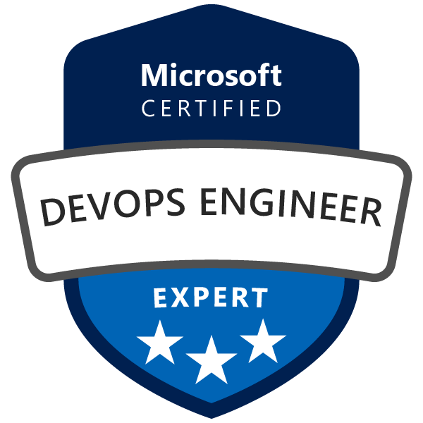
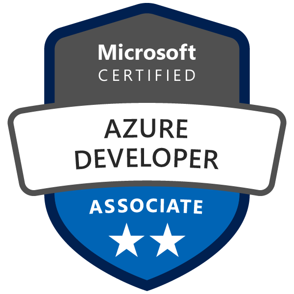

# 👋 Hi, I'm Saurabh!

<!--
**srs2210/srs2210** is a ✨ _special_ ✨ repository because its `README.md` (this file) appears on your GitHub profile.

Here are some ideas to get you started:

- 🔭 I’m currently working on ...
- 🌱 I’m currently learning ...
- 👯 I’m looking to collaborate on ...
- 🤔 I’m looking for help with ...
- 💬 Ask me about ...
- 📫 How to reach me: ...
- 😄 Pronouns: ...
- ⚡ Fun fact: ...
-->

I am an enthusiastic Cloud Engineer who loves to work on cloud-native technologies 👨‍💻

<table>
  <tr>
    <td> </td>
    <td></td>
   </tr>
</table>

Here are some things I put my time into:
- 📝 [Blogging](https://dev.to/srs2210)
- ♾️ DevOps & Automation
- ❄️ Kubernetes

Reach out [on email](mailto:shivgundesaurabh@gmail.com) if you have any thoughts or comments.
